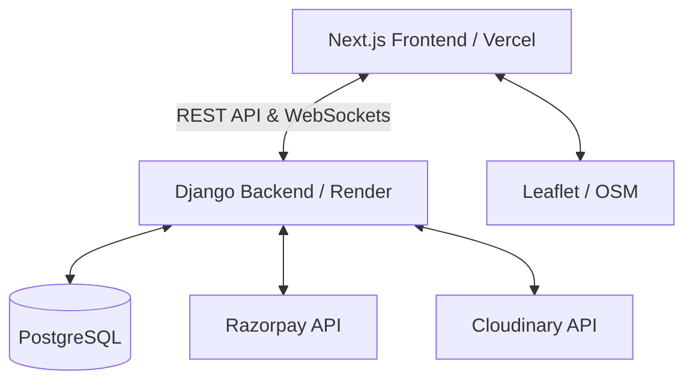

# High-Level Design (HLD)
**Project Name:** RentEase

## 1. System Architecture
RentEase follows a standard client-server architecture with decoupled frontend and backend layers, communicating via RESTful APIs and WebSockets.

## 2. Components
### 2.1. Frontend (Next.js)
- **App Router:** Handles server-side rendering (SSR) and routing.
- **State Management:** Zustand for global state (auth, cart), React Query for server state caching.
- **UI Component Library:** ShadCN UI customized with Tailwind CSS for premium aesthetics.
- **Maps:** Leaflet via `react-leaflet` with OpenStreetMap tiles for interactive, open-source property exploration.

### 2.2. Backend (Django REST Framework)
- **Authentication:** JWT via `djangorestframework-simplejwt`.
- **Database ORM:** Django ORM with PostgreSQL.
- **Real-time:** Django Channels (ASGI) backed by Redis for WebSocket messaging.
- **Media Storage:** Integrated with Cloudinary for handling property images.

### 2.3. Infrastructure & Deployment
- **Frontend Hosting:** Vercel (Edge network, auto-scaling).
- **Backend Hosting:** Render Web Service.
- **Database Hosting:** Render PostgreSQL or Supabase.

## 3. Data Flow
1. **User Request:** The Next.js client sends HTTP requests to the Django API.
2. **Authentication:** The API verifies the JWT token included in the Authorization header.
3. **Processing:** The Django view logic interacts with the PostgreSQL DB via ORM.
4. **Third-Party Integration:** If necessary (e.g., checkout), the backend communicates with Razorpay.
5. **Response:** Data is serialized into JSON and sent back to the client.
