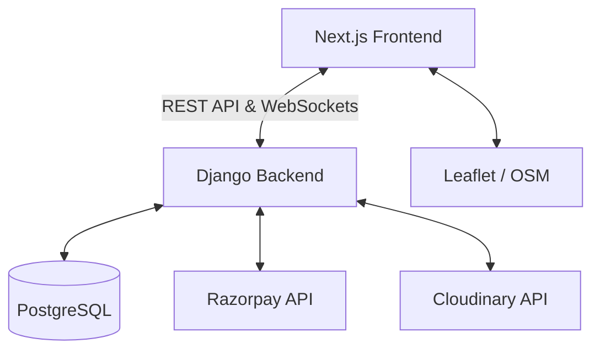

# RentEase – Full-Stack SaaS Property Rental Platform
## Final Implementation & Architecture Summary

This document outlines the final architecture, tech stack, and execution steps that were successfully completed to build RentEase, a modern, scalable, and visually premium property rental marketplace.

## Final Technology Stack
- **Frontend:** Next.js (App Router, React 19), Tailwind CSS, ShadCN UI, Framer Motion (animations), Zustand (state management), React Hook Form, Leaflet/OpenStreetMap.
- **Backend:** Python / Django REST Framework (DRF), SimpleJWT (Auth), Channels (WebSockets).
- **Database:** PostgreSQL (via Django ORM).
- **External Services:** Razorpay (Test Mode / UPI Payments), Cloudinary (Images), WhiteNoise (Production Static Assets).

## Final System Architecture
The application follows a decoupled architecture with a RESTful API backend and a React-based frontend.

## Database Entity Relationship Overview
- **Users:** `id`, `role` (Tenant, Landlord, Admin), `email`, `password_hash`, `first_name`, `last_name`
- **Properties:** `id`, `landlord_id`, `title`, `description`, `address`, `latitude`, `longitude`, `price_per_night`, `amenities` (JSON)
- **Bookings:** `id`, `property_id`, `tenant_id`, `start_date`, `end_date`, `total_price`, `status`
- **Payments:** `id`, `booking_id`, `amount`, `razorpay_order_id`, `status`
- **Conversations:** `id`, `tenant_id`, `landlord_id`, `property_id`
- **Messages:** `id`, `conversation_id`, `sender_id`, `content`

## Completed Execution Phases

### Phase 1: Foundation & Authentication
- Initialized Django backend and Next.js frontend workspaces.
- Implemented User models, JWT Authentication, and Role-Based Access Control (Tenant/Landlord).
- Built the foundational Elite UI design system (Cinematic Dark Mode, Plus Jakarta Sans, Custom magnetic buttons).

### Phase 2: Property Management & Discovery
- Built backend CRUD APIs for Properties.
- Moved Cloudinary upload logic securely to the backend to bypass strict frontend presets.
- Implemented the Frontend Landing Page with immersive 3D/Framer-motion elements.
- Replaced Mapbox with free/open-source Leaflet maps for zero-dependency global property search.
- Built Landlord Dashboard popup overlay for creating Hotel and Villa listings.

### Phase 3: Booking System & Payments
- Availability calendar and Booking request workflow APIs.
- Integrated Razorpay Test Mode checkout APIs alongside native UPI handling logic.

### Phase 4: Real-time Host-Guest Chat
- Built out the `chat` Django app leveraging ASGI, Daphne, and WebSockets.
- Created unique Conversation rooms linking Guests to Hosts based on specific properties.
- Implemented a premium split-pane Messaging Inbox UI in the dashboard mirroring Linear's UX design.

### Phase 5: Deployment Hardening
- Rebuilt `core/settings.py` for cleanly parsing environment variables (`django-environ`).
- Added WhiteNoise to handle `collectstatic` CSS/JS bundling in production.
- Resolved strict Next.js TypeScript build errors (`useAuthStore`).
- Generated `render.yaml` with explicit Daphne WebSockets support.
