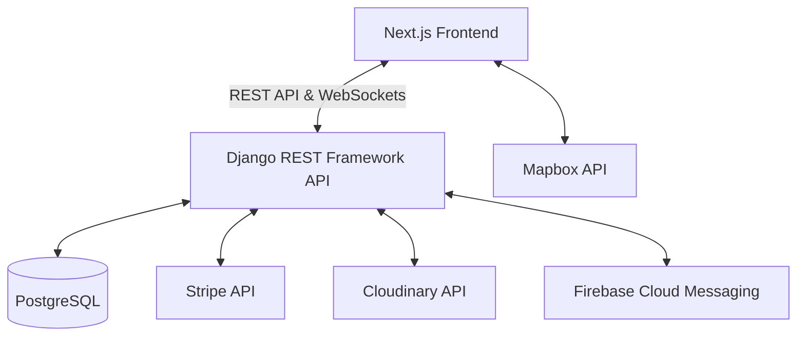

# RentEase – Full-Stack SaaS Property Rental Platform

This document outlines the architecture, tech stack, and execution plan for building RentEase, a modern, scalable, and visually premium property rental marketplace connecting landlords and tenants. The platform will be built from scratch, emphasizing a highly polished, enterprise-grade UI/UX (comparable to Airbnb, Stripe, and Linear) and robust backend architecture.

## User Review Required

> [!IMPORTANT]
> The scope of this project is massive (a full SaaS platform). Building this completely from scratch requires prioritizing the initial phases. We will build the foundational architecture and key user flows first.
> Please review the chosen technology stack below to ensure it aligns with your expectations before we proceed.

## Open Questions

> [!WARNING]
> 1. **Backend Choice:** I have selected **Django REST Framework (DRF)** over ASP.NET Core because Django provides a highly capable Admin Dashboard out-of-the-box, which directly fulfills your "Admin Dashboard" requirement quickly, and interfaces excellently with PostgreSQL. Are you okay with DRF?
> 2. **Maps Integration:** I selected **Mapbox** for its superior styling capabilities to match the premium UI requirement. Is Mapbox acceptable, or do you strictly prefer Google Maps?
> 3. **Payments and Storage:** I have selected **Stripe** for payments and **Cloudinary** for image storage as they are developer-friendly and fit the modern SaaS requirements perfectly. Are these acceptable?

## Technology Stack

- **Frontend:** Next.js (App Router, React), Tailwind CSS, ShadCN UI, Framer Motion (animations), Zustand (state management), React Hook Form + Zod (validation), Mapbox.
- **Backend:** Python / Django REST Framework (DRF), SimpleJWT (Auth).
- **Database:** PostgreSQL.
- **External Services:** Stripe (Payments), Cloudinary (Images), Firebase Cloud Messaging (Notifications), WebSockets (Django Channels for real-time chat).

## System Architecture

The application will follow a decoupled architecture with a RESTful API backend and a React-based frontend.



## Database Entity Relationship (ERD) Overview

- **Users:** `id`, `role` (Tenant, Landlord, Admin), `email`, `password_hash`, `first_name`, `last_name`, `profile_picture`, `is_verified`, `created_at`
- **Properties:** `id`, `landlord_id`, `title`, `description`, `address`, `latitude`, `longitude`, `price_per_night`, `amenities` (JSON), `is_active`, `created_at`
- **PropertyImages:** `id`, `property_id`, `image_url`, `is_primary`
- **Bookings:** `id`, `property_id`, `tenant_id`, `start_date`, `end_date`, `total_price`, `status` (Pending, Approved, Rejected, Cancelled, Completed), `created_at`
- **Payments:** `id`, `booking_id`, `amount`, `stripe_charge_id`, `status`, `created_at`
- **Messages:** `id`, `sender_id`, `receiver_id`, `content`, `is_read`, `created_at`

## Project Structure (Feature-Based)

```text
d:\RentEase\
├── backend/                  # Django REST Framework
│   ├── manage.py
│   ├── core/                 # Main settings
│   ├── users/                # Auth, Roles, Profiles
│   ├── properties/           # Property listings, Search
│   ├── bookings/             # Reservations, Calendar
│   ├── payments/             # Stripe integration
│   └── chat/                 # WebSockets, Messaging
└── frontend/                 # Next.js Application
    ├── public/               # Static assets
    ├── src/
    │   ├── app/              # Routes (Next.js App Router)
    │   ├── components/       # ShadCN, Reusable UI
    │   ├── features/         # Feature-based logic (auth, properties)
    │   ├── lib/              # Utils, API clients (Axios)
    │   └── store/            # Zustand stores
```

## Proposed Execution Phases

Due to the scale of the application, development will be split into logical phases:

### Phase 1: Foundation & Authentication
- Initialize Django backend and Next.js frontend workspaces.
- Configure PostgreSQL database.
- Implement User models, JWT Authentication, and Role-Based Access Control (RBAC).
- Setup Tailwind CSS, ShadCN UI, and base design system (Colors, Typography).

### Phase 2: Property Management & Discovery
- Backend CRUD APIs for Properties.
- Image upload integration with Cloudinary.
- Frontend Landing Page and Property Search Page with Mapbox integration.
- Landlord Dashboard for managing properties.

### Phase 3: Booking System & Payments
- Availability calendar and Booking request workflow.
- Stripe integration for secure checkout.
- Webhooks to update payment status.

### Phase 4: Real-time Features & Polish
- Django Channels for real-time messaging between Landlord and Tenant.
- Firebase Cloud Messaging for notifications.
- Admin dashboard setup using Django Admin (customized).
- Final UI polish, animations (Framer Motion), and performance optimization.

## Verification Plan

### Automated Tests
- Backend API testing using Django's test framework (`pytest-django`).
- Frontend component testing using Jest and React Testing Library.

### Manual Verification
- Verify User Authentication flows (Register, Login, JWT refresh).
- Complete a full property creation flow with image uploads.
- Complete a tenant search, booking request, and mock Stripe payment.
- Test real-time messaging with multiple browser sessions.
- Audit the UI against the "Premium UI/UX Requirements" (Lighthouse score, responsiveness).
